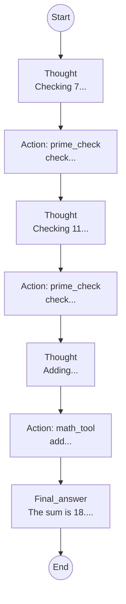
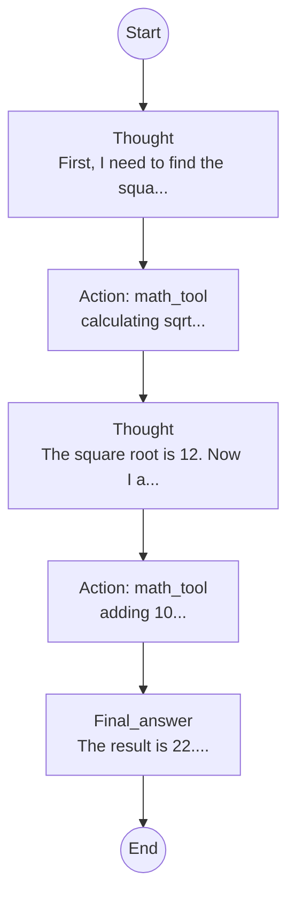
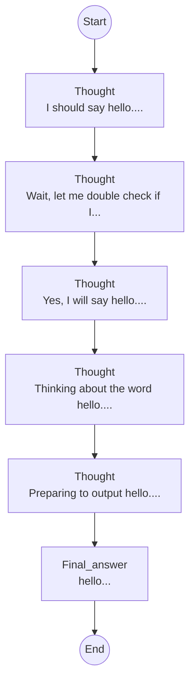
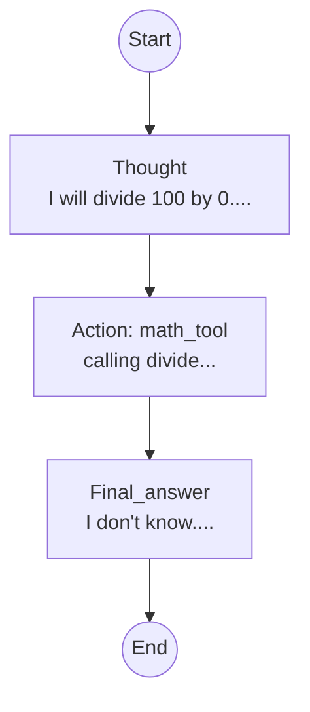

# Agent Evaluation Report
## Agent Profile: jules-agent

### Behavioral Fingerprint
- **Behavioral Bias**: balanced
- **Avg Steps/Task**: 5.25
- **Thought/Action Ratio**: 1.83
- **Total Tokens**: 2550

### Task Breakdown
| Task ID | Final Score | Success | Reasoning | Constraints | Efficiency |
|---------|-------------|---------|-----------|-------------|------------|
| T-102 | 0.99 | 1.00 | 0.40 | 1.00 | 0.90 |
| T-100 | 1.00 | 1.00 | 0.75 | 1.00 | 1.00 |
| T-103 | 0.63 | 1.00 | 0.75 | 1.00 | 0.61 |
| T-101 | 0.52 | 0.00 | 0.40 | 1.00 | 0.67 |

### Agent Trajectories (Visualization)
#### Task: T-102

#### Task: T-100

#### Task: T-103

#### Task: T-101

**Aggregate Benchmark Score: 0.79**